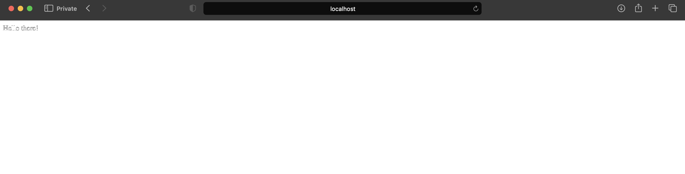
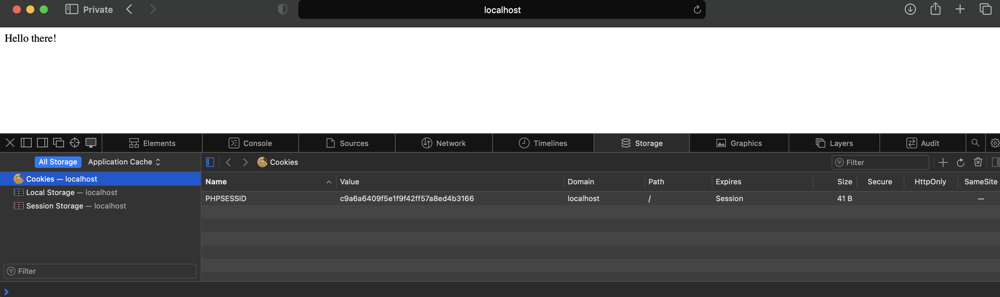
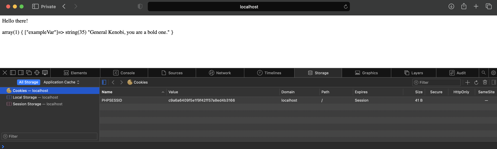
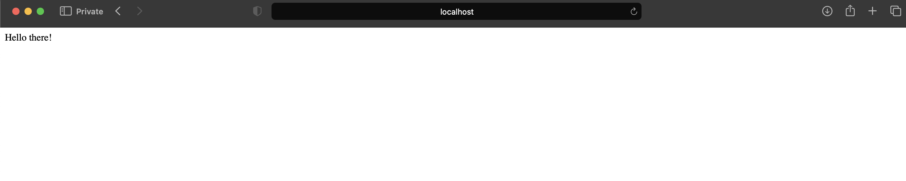
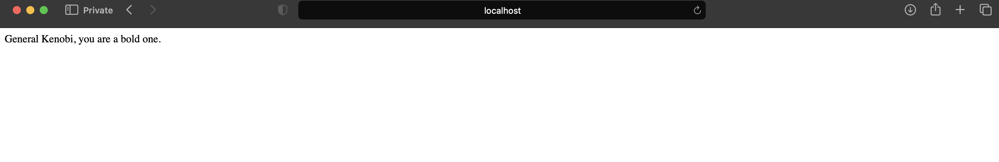

# The Ins and Outs of PHP Sesions
With Ethan Haggart

## Introduction

### What _is_ PHP?
PHP is an interpreted programming language used primarily in web development. It is run entirely on the web server, and only the resulting HTML is passed back to the client to be displayed. This means that unlike languages like JavaScript, the client has no access to PHP code.

#### Wait. Client? Server? What?
Websites consist of many moving parts that work together to create the user experience many people are used to. When someone opens Google Chrome, Safari, or any browser they are opening a program that is running on their machine. That program can do things like display web pages, search the internet, and run JavaScript code. A browser does not hold all of the websites on the internet, though (that would be a pretty massive local database). Instead, the browser relies on being "served" websites from other places on the internet, known as servers.

A server's only job is to receive and fulfill requests. A client connects from the client's browser, sending a request to the server. The server then has to figure out what the client is requesting and send that information back to the client. It gets the right files and sends them back so the browser can display them to the user. That is what happens when someone accesses a website on the internet. A client asked a server for information, and the server sent that information back across the internet.

#### And how does that apply to PHP?
PHP runs on the server. That means it finishes executing long before the client receives the webpage. By then, all calculations have been done. All variables have been used. There is nothing left for the client to do except to display the page. It is useful for keeping internal systems secret from the client so that the client does not have access to internal information, and for accessing things like databases in a safe way.

### The Problem
Since PHP runs on the Server _only_, it is difficult to create something called state. State is like a cross-section of a program while it is running. It represents the current parts of the program and the information available at a given time. It is easy to have state with something like JavaScript that is running in the client. PHP runs on the server, though, so all the communication comes through HTML requests and responses. The client cannot access anything when the server is running, and the server cannot respond to anything on the client unless asked.

State is very, very useful when web programming. One great example of state is authentication. When someone logs in to a website, that login should remain valid for each new page served by the server. The client should not have to put in credentials every time a new page is accessed. If the client needs to request information specific to the logged-in user, it should be able to do so with no problem. With a defined state, the client and server can pass information back and forth to make this process seamless. Without state, PHP is not very useful.

### The Solution
The solution is quite simple. It is, just store the information on the server! This passing of information works through something called sessions. A PHP session is just a temporary file created on the server that holds information about a specific client. It contains session variables that can be accessed across all other files. It has a timeout value, and while it has not yet expired it will be valid.

#### How are sessions made?
PHP initiates the session, creating a temporary session file stored on the server. The server passes a unique identifier back to the client in the form of a cookie. Whenever the client connects to the server, the cookie is passed, too. It tells the server which session to use based on the identifier provided by the cookie. The cookie is not persistent, so when the browser is closed the session is lost.

Now there is state! The server knows who the client is and can hold information about the client. Things like authentication, updating pages, and other interactive features are now possible with a PHP session. As long as the user does not close the browser and the cookie does not expire, the session will be active. This is how websites keep a user logged in even when a tab is closed and reopened.

Let's get down to business and walk through an example for how to go about creating a session in PHP.

## Tutorial

### Setup
If you want to follow along exactly, make sure you have some text editor available to write your code and some way to host a local server. Otherwise reading will be sufficient.

I would suggest using VS Code and Docker containers if you decide to follow along, since they are easy to work with. They are not necessary nor relevant to this tutorial, so instructions will not be provided for setting up a Docker container nor for downloading extansions on VS Code. If you want to download Docker or VS Code, the links are available in the Additional Resources section If you do not know how to set up the docker-compose.yml file or how to set up a Dockerfile so that you can use php, you can use the files provided in this repository.

### Step 1: Create an index.php
We want to create a basic php file so that we can test using sessions. Make a file named "index.php" and put in some basic HTML so that it will display on your browser. If you are following along on your device, make sure that your Docker container is up and running so that you can view the website on localhost.

#### The index.php I created:
```
<?php
echo "<p>Hello there!</p>";
?>
```
#### The website displayed in my browser:


### Step 2: Initiate the session
We need to initiate the session. We do this by using the `session_start()` function. Add this at the beginning of your index.php in order to initiate the session right from the begnning.

#### `session_start()` in my index.php
```
<?php
session_start();
echo "<p>Hello there!</p>";
?>
```

This will not change anything on the website, but we can see the cookie generated by the function call. Open your browser inspector and select storage, then cookies. There should now be a cookie there representing the session!

#### The cookie representing my session


### Step 3: Session variables
That is all well and good, but we want to showcase just little bit of what sessions can do. We will start with how to set a session variable. You can access the session after calling `session_start()` with `$_SESSION`. `$_SESSION` is an array of key-value pairs. To add a variable to the session or access a variable in the session, use the syntax `$_SESSION[<"<variable name>">]`.

#### Adding a session variable to my index.php
```
<?php
session_start();
echo "<p>Hello there!</p>";
$_SESSION["exampleVar"] = "General Kenobi, you are a bold one.";
echo "<p>".var_dump($_SESSION)."</p>";
?>
```

You can view the contents of a variable using `var_dump(<variable name>)`. Echo that to the website and you can verify that the session variable was stored correctly.

#### Contents of `$_SESSION` displayed with `var_dump()`


### Step 4: This is where the fun begins
Now that you can initiate a session and store session variables, the power is in your hands to use sessions. Please use them in an ethical way. I have included something really simple I made with sessions. Now you are prepared to go forth and code. Have fun!

The following code will change what is displayed each time the site is reloaded.

#### My simple index.php program using session variables
```
<?php
session_start();
if ($_SESSION["exampleVar"]) {
  echo "<p>General Kenobi, you are a bold one.</p>";
  $_SESSION["exampleVar"] = false;
} else {
  echo "<p>Hello there!</p>";
  $_SESSION["exampleVar"] = true;
}
?>
```

#### The initial page on first navigation


#### The new text after reloading


## Final Words
Sessions are extremely useful. They provide a way to have a global state across the client and the server. The server can tailor information to the client and can provide for multiple users and multiple clients to use the same databases. It is an elegant solution to a difficult problem.

As far as security goes, default PHP sessions are very secure because they implement digital signatures in the cookies stored on the client browser. Digital signatures are extremely difficult to forge, which in cryptography means basically impossible. If you use a PHP session, you do not need to worry about forged cookies. If you do not use default sessions, there might be security issues. Stay vigilant and choose safe software.

One unfortunate issue with sessions is that they do not scale well. A file is created on the server for each user. The file may be small, but with enough users that could be a lot of storage dedicated to sessions. The more users, the larger the cost will be to the server in space and performance. For companies like Google that have a ridiculous number of users constantly accessing their sites, sessions are rendered useless.

That being said, for many purposes they are an easy solution to the problem of global state. If your site does not expect extremely high volumes of users, then sessions are probably the cheap way to go.

## Additional Resources
https://www.w3schools.com/php/php_sessions.asp - W3 Schools is an excellent resource for web programming. If you need a quick refresher on the syntax, go to them. They have examples that can help you remember the technical part of setting up a session.

https://www.php.net/manual/en/book.session.php - This is the official PHP manual for sessions. It documents everything that can be done with sessions and all of the relevant functions. It is very dense and technical, but if you want to do something complicated with sessions this should be a go-to to even understand what is possible.

https://www.youtube.com/watch?v=DtiQLCFWsVU - This is an excellent video walkthrough for everything that was present in the Tutorial section. It also provides more coverage of HTML and PHP's role.

https://www.phptutorial.net/php-tutorial/php-session/ - This is a nice intermediate article about sessions. It is much more in-depth than W3 Schools but is not dense like the official PHP documentation.

https://www.docker.com - This is the Docker website, in case you need to install Docker for the purposes of the tutorial.

https://code.visualstudio.com - This is the VS Code website, in case you need to install it for the purposes of the tutorial.